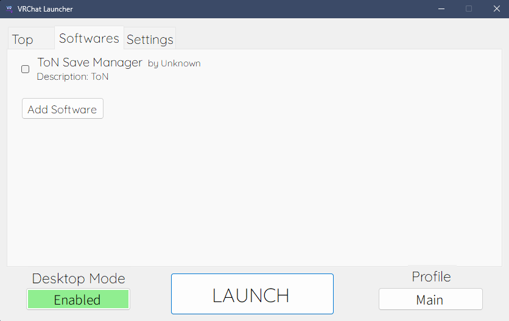

# osu! Launcher    

> [\[discord\]](https://discord.gg/AGNDPsZPya) Free and open-source, feature-rich, powerful launcher for osu!.

**osu! Launcher** is a feature-rich and open-source launcher for osu!, aiming to make your experience even better than before.

## ScreenShots

 
 

## Features

### 1. Easy Login to osu! Private Server
- Automatically inputs your username (profile ID) into osu!.
- Password is copied to your clipboard, so logging in only requires pressing **Ctrl+V** when osu! starts.

### 2. Detailed Profile Customization
- Each profile allows you to configure:
  - Score meter size and type
  - Resolution
  - Volume
  - Offset
  - Skin
  - The server that the profile will use

### 3. Add Programs to Launch with osu!
- Easily add programs to launch automatically when osu! starts.

### 4. Automatic Display of osu! Web Top Page
- The osu! web top page is displayed automatically upon launching the osu! Launcher, so you can stay updated with the latest news.

### 5. User-Friendly UI
- Designed with a clean and intuitive interface for a better user experience.
